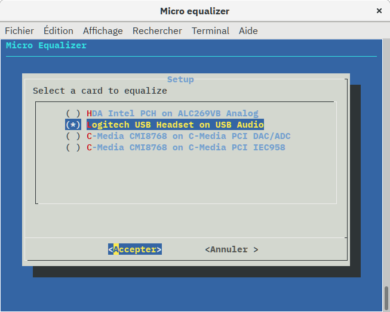

Micro equalizer
===============

Micro equalizer is a simple Bash script that will configure Jack and two LV2
plugins to enhance cheap microphone sound in realtime.

It aims at making PulseAudio and Jack live peacefully side by side.

What it is able to do
---------------------

There is a sample MP3 demonstrating what Micro equalizer is able to do:

[comparison.mp3 (~700 Kbytes)](snd/comparison.mp3)

It contains 4 settings while using a "Logitech PC Headset 960 USB":

- **without** equalizer, **without** noise reduction,
- **without** equalizer, **with** noise reduction,
- **with** equalizer, **without** noise reduction,
- **with** equalizer, **with** noise reduction.

Though it is in french, you should be able to hear the difference.

Requirements
------------

The `micro-equalizer` requires the following programs:

- Dialog,
- PulseAudio (probably already installed),
- Jack,
- Jalv,
- LV2 utilities,
- LV2 EQ10Q equalizer plugin,
- LV2 Noise Repellent plugin.

The plugins apart, these can be installed on Debian-like distribution with the
following command:

    sudo apt install dialog pulseaudio-module-jack jalv lv2file

EQ10Q and Noise Repellent are not available as packages.

You can find them on their sites:

- http://eq10q.sourceforge.net
- https://github.com/lucianodato/noise-repellent

If you run an x86_64 system, you need to do nothing because they have been
conveniently included in the `lv2` subdirectory. If not, you will need to
compile and install them or `micro-equalizer` won’t run.

Optional
--------

You may install `patchage` to see what’s going on under the hood.

It can be installed on Debian-like distribution with the following command:

    sudo apt install patchage

To use it, type:

    JACK_DEFAULT_SERVER=micro-equalizer patchage

Usage
-----

Configuration:

    micro-equalizer setup
    
Run:

    micro-equalizer run

Stop:

    micro-equalizer kill

Configuration
-------------

Type in a terminal:

    micro-equalizer setup

It then shows a setup wizard (you may leave it any time).

First, select the device on which your microphone is connected. In my case, it
is a Logitech USB headset.

Choose a name that will be displayed in your PulseAudio applications when you
have to select a microphone.

Choose a name that will be displayed in your PulseAudio applications when you
have to select loudspeakers.

In the next step, the setup wizard asks you for an equalizer preset. If this is
the first time you use `micro-equalizer`, chances are that you have no preset at
this point. Leave this field empty.

As for the equalizer, the setup wizard asks you for a noise reduction preset.
Again, you may leave this field empty.

The setup wizard finally asks you if you want to write your configuration.

That’s it!

You may now use `micro-equalizer`:

    micro-equalizer run

Notes on presets
----------------

You can save preset for the equalizer and the noise reduction plugins by using
the Presets → Save preset… menu entry.

On the versions I’ve used, the presets are saved incorrectly.

I need to rename one file to `state.ttl` in order to have two files:

- `state.ttl`,
- `manifest.ttl`.

Screenshots
-----------

Here are some screenshots showing Micro equalizer in action:

